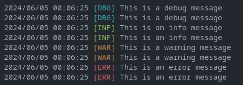

# Usage 🚀

## Importing the Package 📦

First, import the package in your Go file:

```go
import "github.com/catalystgo/xro-log/log
```

## Setting Log Level 📏

You can set the current log level using the `SetLevel` function. The available log levels are:

- `LevelDebug`
- `LevelInfo`
- `LevelWarn`
- `LevelError`
- `LevelFatal`

For example, to set the log level to `LevelDebug`:

```go
log.SetLevel(log.LevelDebug)
```

## Logging Messages 📝

You can log messages at different levels using the following functions:

- `Debug(msg string)`
- `Debugf(msg string, args ...interface{})`
- `Info(msg string)`
- `Infof(msg string, args ...interface{})`
- `Warn(msg string)`
- `Warnf(msg string, args ...interface{})`
- `Error(msg string)`
- `Errorf(msg string, args ...interface{})`
- `Fatal(msg string)`
- `Fatalf(msg string, args ...interface{})`

Each log level has its own prefix and color:



## Examples 🚀

Here are some examples of how to use the logging functions:

```go
log.SetLevel(log.LevelDebug)

log.Debug("This is a debug message")
log.Debugf("This is a debug message with a variable: %d", 42)

log.Info("This is an info message")
log.Infof("This is an info message with a variable: %d", 42)

log.Warn("This is a warning message")
log.Warnf("This is a warning message with a variable: %d", 42)

log.Error("This is an error message")
log.Errorf("This is an error message with a variable: %d", 42)

log.Fatal("This is a fatal message")
log.Fatalf("This is a fatal message with a variable: %d", 42)

// Panic functions can't be disabled by setting the log level to a higher value
// since they are meant to be used in critical situations where the application can't continue

log.Panic("This is a panic message")
log.Panicf("This is a panic message with a variable: %d", 42)
```

## License 📑

This project is licensed under the MIT License. See the [LICENSE](LICENSE) file for details.

## Contributing 🤝

Contributions are welcome! Please feel free to submit a pull request or open an issue.
